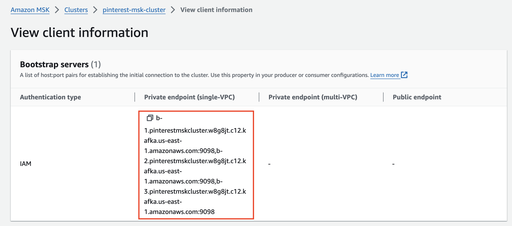
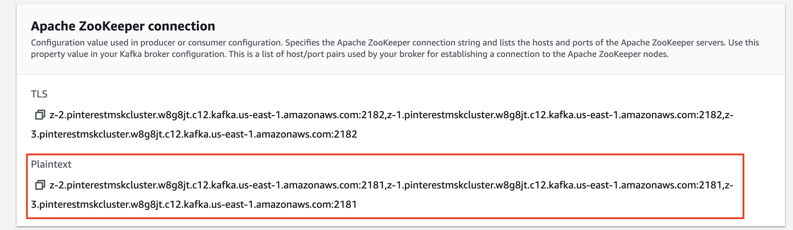

# Milestone 3 - Batch Processing: Configuring the EC2 Kafka Client

## Task 1
A ```.pem``` key file was created locally using the Parameter Store in the AWS Console.

## Task 2
### Connect to the EC2 instance via the SSH Client

First, appropriate permissions for the ```.pem``` key file were set so that only the owner can access it:
```
chmod 400 /Users/kay/Desktop/AiCore/Projects/pinterest-data-pipeline613/0a40ea42f8d1-key-pair.pem
```
Now the following connection command was run in the terminal to connect to the EC2 instance:
```
ssh -i "0a40ea42f8d1-key-pair.pem" ec2-user@ec2-52-207-26-231.compute-1.amazonaws.com
```

## Task 3
### Set up Kafka on the EC2 Client

While inside the EC2 Client, both ```Java``` and ```Apache Kafka``` were installed:
```
sudo yum install java-1.8.0
wget https://archive.apache.org/dist/kafka/2.8.1/kafka_2.12-2.8.1.tgz
tar -xzf kafka_2.12-2.8.1.tgz
```

An ```IAM MSK authentication package``` was also installed:
```
cd /kafka_2.12-2.8.1/libs
wget https://github.com/aws/aws-msk-iam-auth/releases/download/v1.1.5/aws-msk-iam-auth-1.1.5-all.jar
```

#### Configuring the Kafka Client to use AWS IAM

Made a note of the ```IAM access role ARN```.

The trust relationship was edited by replacing ARN with the ```IAM access role ARN``` so that it would be able to assume the ```0a40ea42f8d1-ec2-access-role```, which contains the necessary permissions to authenticate to the MSK cluster.


#### ```client_properties``` file was created inside ```kafka_2.12-2.8.1/bin``` directory:

```
cd /home/ec2-user
touch kafka_2.12-2.8.1/bin/client.properties
nano kafka_2.12-2.8.1/bin/client.properties
```
The following was added to the file:

```py
# Sets up TLS for encryption and SASL for authN.
security.protocol = SASL_SSL

# Identifies the SASL mechanism to use.
sasl.mechanism = AWS_MSK_IAM

# Binds SASL client implementation.
sasl.jaas.config = software.amazon.msk.auth.iam.IAMLoginModule required awsRoleArn="arn:aws:iam::584739742957:role/0a40ea42f8d1-ec2-access-role";

# Encapsulates constructing a SigV4 signature based on extracted credentials.
# The SASL client bound by "sasl.jaas.config" invokes this class.
sasl.client.callback.handler.class = software.amazon.msk.auth.iam.IAMClientCallbackHandler
```

## Task 4

### Create Kafka Topics

The MSK cluster ```Bootstrap servers string``` and ```Plaintext Apache Zookeeper connection string``` were retrieved and made a note of:




Navigated to the ```kafka_2.12-2.8.1/bin``` and created kafka topics for pin, geo and users:
```
./kafka-topics.sh --bootstrap-server b-3.pinterestmskcluster.w8g8jt.c12.kafka.us-east-1.amazonaws.com:9098,b-1.pinterestmskcluster.w8g8jt.c12.kafka.us-east-1.amazonaws.com:9098,b-2.pinterestmskcluster.w8g8jt.c12.kafka.us-east-1.amazonaws.com:9098 --command-config client.properties --create --topic 0a40ea42f8d1.pin

./kafka-topics.sh --bootstrap-server b-3.pinterestmskcluster.w8g8jt.c12.kafka.us-east-1.amazonaws.com:9098,b-1.pinterestmskcluster.w8g8jt.c12.kafka.us-east-1.amazonaws.com:9098,b-2.pinterestmskcluster.w8g8jt.c12.kafka.us-east-1.amazonaws.com:9098 --command-config client.properties --create --topic 0a40ea42f8d1.geo

./kafka-topics.sh --bootstrap-server b-3.pinterestmskcluster.w8g8jt.c12.kafka.us-east-1.amazonaws.com:9098,b-1.pinterestmskcluster.w8g8jt.c12.kafka.us-east-1.amazonaws.com:9098,b-2.pinterestmskcluster.w8g8jt.c12.kafka.us-east-1.amazonaws.com:9098 --command-config client.properties --create --topic 0a40ea42f8d1.user
```


