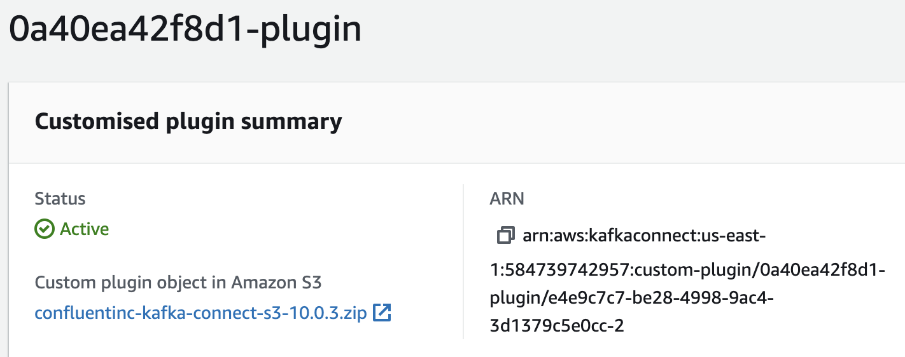
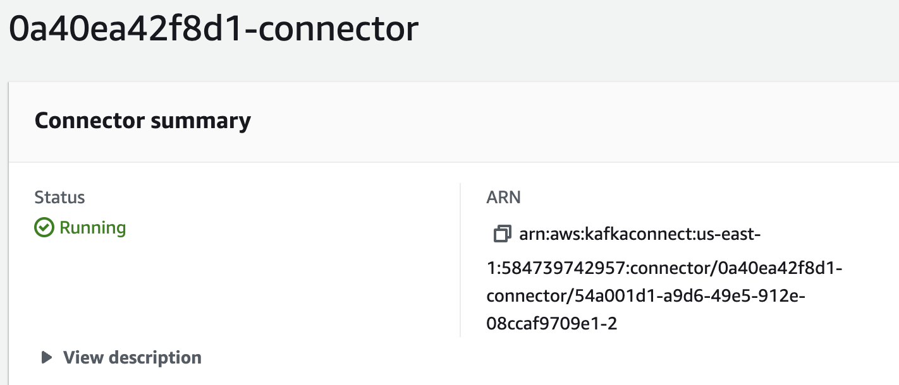

# Milestone 4 - Batch Processing: Connect an MSK Cluster to an S3 Bucket

## Task 1
### Create a custom plugin with MSK Connect

Made a note of the S3 bucket name. While in the EC2 Client, the `Confluent.io Amazon S3 Connector` was downloaded and copied to the S3 bucket:

```
sudo -u ec2-user -i
mkdir kafka-connect-s3 && cd kafka-connect-s3
wget https://d1i4a15mxbxib1.cloudfront.net/api/plugins/confluentinc/kafka-connect-s3/versions/10.0.3/confluentinc-kafka-connect-s3-10.0.3.zip
aws s3 cp ./confluentinc-kafka-connect-s3-10.0.3.zip s3://user-0a40ea42f8d1-bucket/kafka-connect-s3/
```

Custom plugin was created in the MSK Connect console:



## Task 2
### Create a connector with MSK Connect

The connector was created, selecting the custom plugin just created and the `pinterest-msk-cluster`.

The Connector configuration settings below were added:
```
connector.class=io.confluent.connect.s3.S3SinkConnector
s3.region=us-east-1
flush.size=1
schema.compatibility=NONE
tasks.max=3
topics.regex=0a40ea42f8d1.*
format.class=io.confluent.connect.s3.format.json.JsonFormat
partitioner.class=io.confluent.connect.storage.partitioner.DefaultPartitioner
value.converter.schemas.enable=false
value.converter=org.apache.kafka.connect.json.JsonConverter
storage.class=io.confluent.connect.s3.storage.S3Storage
key.converter=org.apache.kafka.connect.storage.StringConverter
s3.bucket.name=user-0a40ea42f8d1-bucket
```



