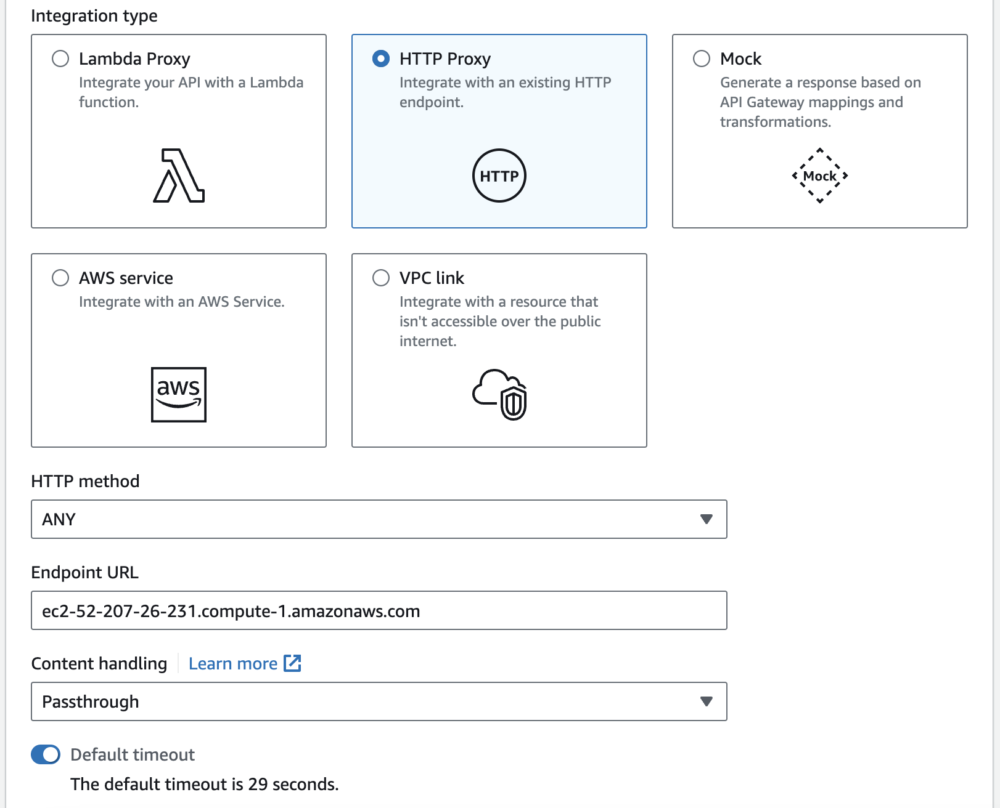

# Milestone 5 - Batch Processing: Configuring an API in API Gateway

## Task 1
### Build a Kafka REST proxy integration method for the API

An empty API was already been provided.

A resource that allows you to build a ```PROXY``` integration for the API was created:


A ```HTTP ANY``` method was created, providing the correct ```PublicDNS``` for the ```EndPoint URL``` from the EC2 machine:




The API was deployed, taking note of the Invoke URL.

## Task 2
### Set up the Kafka REST proxy on the EC2 client

The confluent package for the Kafka REST proxy was installed on EC2 client:

```
cd /home/ec2-user/
sudo wget https://packages.confluent.io/archive/7.2/confluent-7.2.0.tar.gz
tar -xvzf confluent-7.2.0.tar.gz
```
Navigated to ```confluent-7.2.0/etc/kafka-rest``` and opened the ```kafka-rest.properties``` file for modificaiton:

```
nano kafka-rest.properties
```

The ```bootstrap.servers``` and the ```zookeeper.connect``` variables in this file were modified with the corresponding ```Boostrap server string``` and ```Plaintext Apache Zookeeper connection string```:

```
zookeeper.connect=z-2.pinterestmskcluster.w8g8jt.c12.kafka.us-east-1.amazonaws.com:2181,z-1.pinterestmskcluster.w8g8jt.c12.kafka.us-east-1.amazonaws.com:2181,z-3.pinterestmskcluster.w8g8jt.c12.kafka.us-east-1.amazonaws.com:2181
bootstrap.servers=PLAINTEXT://b-3.pinterestmskcluster.w8g8jt.c12.kafka.us-east-1.amazonaws.com:9098,b-1.pinterestmskcluster.w8g8jt.c12.kafka.us-east-1.amazonaws.com:9098,b-2.pinterestmskcluster.w8g8jt.c12.kafka.us-east-1.amazonaws.com:9098
```

The properties below were also added to surpass the IAM authentication of the MSK cluster:

```py
# Sets up TLS for encryption and SASL for authN.
client.security.protocol = SASL_SSL

# Identifies the SASL mechanism to use.
client.sasl.mechanism = AWS_MSK_IAM

# Binds SASL client implementation.
client.sasl.jaas.config = software.amazon.msk.auth.iam.IAMLoginModule required awsRoleArn="arn:aws:iam::584739742957:role/0a40ea42f8d1-ec2-access-role";

# Encapsulates constructing a SigV4 signature based on extracted credentials.
# The SASL client bound by "sasl.jaas.config" invokes this class.
client.sasl.client.callback.handler.class = software.amazon.msk.auth.iam.IAMClientCallbackHandler
```

The ```REST``` proxy was started on the EC2 client machine:
```
./kafka-rest-start /home/ec2-user/confluent-7.2.0/etc/kafka-rest/kafka-rest.properties
```

Once the REST proxy has started, you should see a ```INFO Server started, listening for requests...``` in your EC2 console

## Task 3
### Send data to the API

```user_posting_emulation.py``` was modified to send data to the coresponding Kafka topics using the ```API Invoke URL```:

```FIX LINK TO FILE ```
[batch_user_posting_emulation.py]()

In a separate terminal to the one containing the listening REST proxy, the ```batch_user_posting_emulation.py``` was executed returning status code 200 for every record successfully sent to API, while the terminal containing the listening REST proxy as returned confirmation of every record being sent to the API:

```Terminal 1:```


```Terminal 2:```


The ```batch_user_posting_emulation.py``` was allowed to run until there was a sufficient number of records and then the S3 Bucket was checked to verify that the data was being stored correctly in each topic:


