# Milestone 7 - Batch Processing: Spark on Databricks

## Tasks 1-3
### Cleaning the pin, geo and user data in Databricks

Data was cleaned using the code in notebook
(```link to notebook here```) cleaning_batch_data.ipynb

Schema outputs to check data cleaning is shown in notebook:

pin_df:

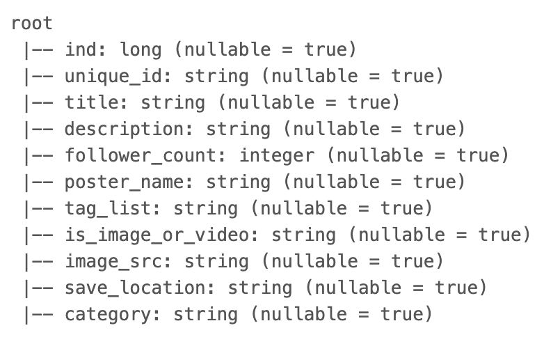

geo_df:

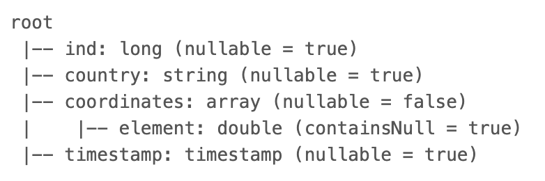

user_df:

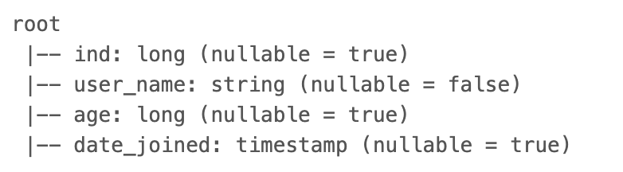


## Tasks 4-11
### Querying the data

The data was queried using the code in notebook
(```link to notebook here```) querying_batch_data.ipynb

Query outputs are shown in the notebook:

####  Query 1 - Find the most popular category in each country

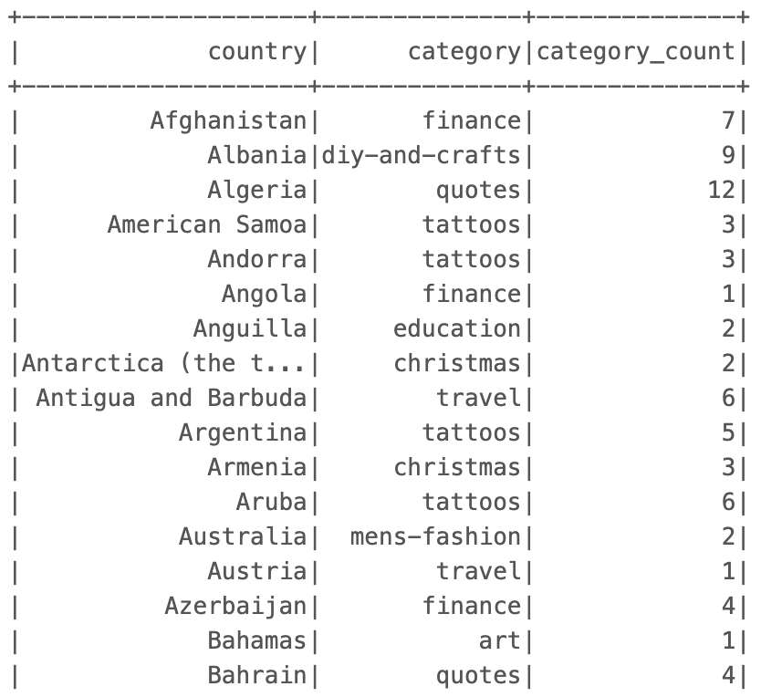


####  Query 2 - Find which was the most popular category each year between 2018 and 2022

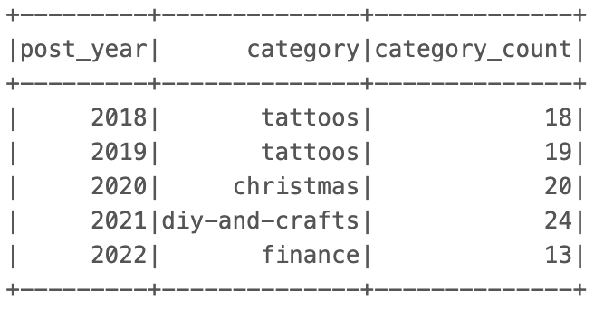


####  Query 3 - Find the user with the most followers in each country

####  Query 3.1 - For each country find the user with the most followers

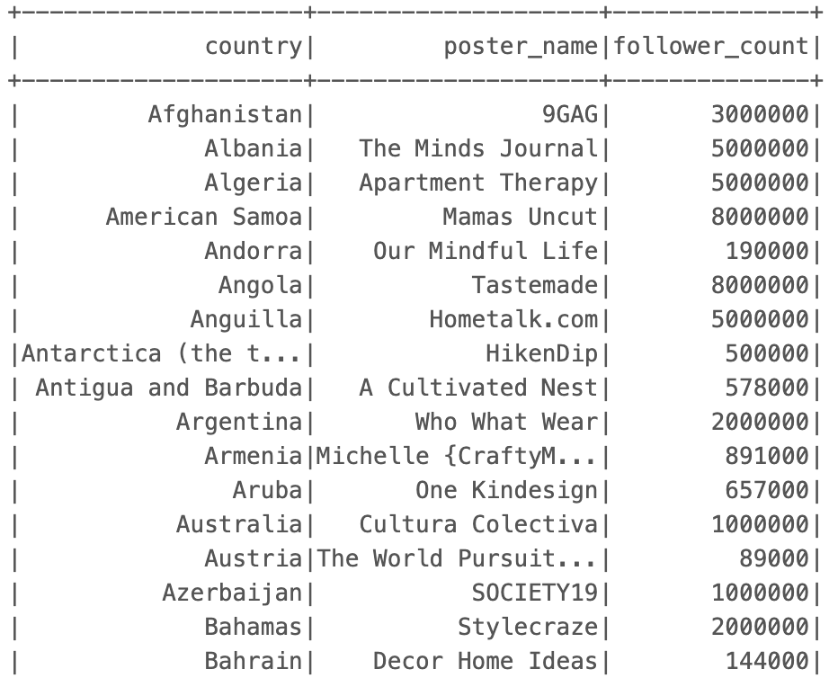


####  Query 3.2 - Based on the above query, find the country with the user with most followers

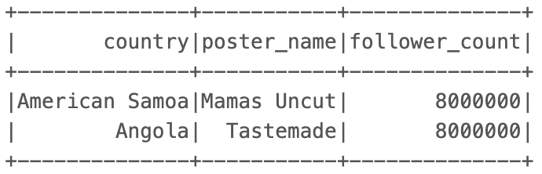


####  Query 4 - Find the most popular category in each age group

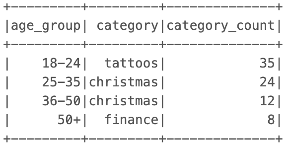


####  Query 5 - Find the median follower count of users in each age group

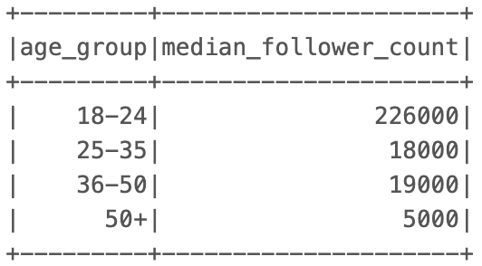


####  Query 6 - Find how many users have joined each year between 2015 and 2020

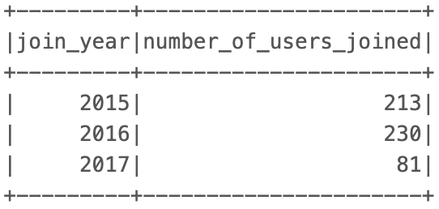


####  Query 7 - Find the median follower count of users that joined between 2015 and 2020

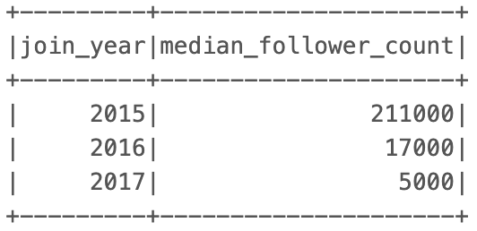


####  Query 8 - Find the median follower count of users that joined between 2015 and 2020 in each age group

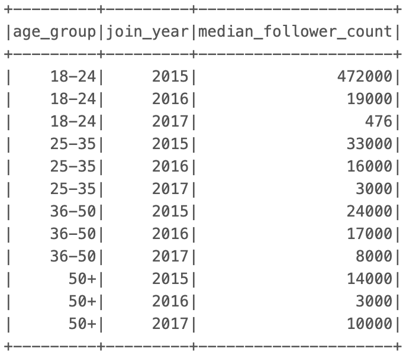


