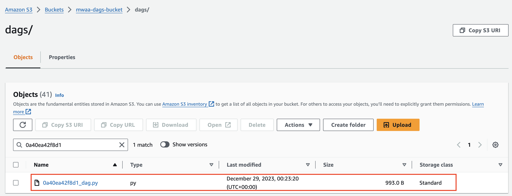
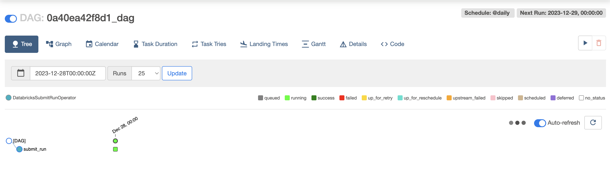

# Milestone 8 - Batch Processing: AWS MWAA

## Task 1
### Create and upload a DAG to the MWAA environment

The MWAA `Databricks-Airflow-env` and S3 bucket `mwaa-dags-bucket`, were already provided.

In Databricks, the filepath of the one notebook which extracts, cleans and queries the data from the S3 Bucket was retrieved as well as the cluster-id:

```
# Retrieve filepath of notebook
dbutils.notebook.entry_point.getDbutils().notebook().getContext().notebookPath().get()

# Retrieve cluster-id
spark.conf.get("spark.databricks.clusterUsageTags.clusterId")
```

The DAG file [`0a40ea42f8d1_dag.py`](../0a40ea42f8d1_dag.py) was created with relevant notebook path and cluster-id and set to run daily

The DAG file was then uploaded to the DAGs folder in the `mwaa-dags-bucket` S3 bucket:




## Task 2
### Trigger a DAG that runs a Databricks Notebook

In the MWAA Airflow UI, the DAG was manually triggered:

 
