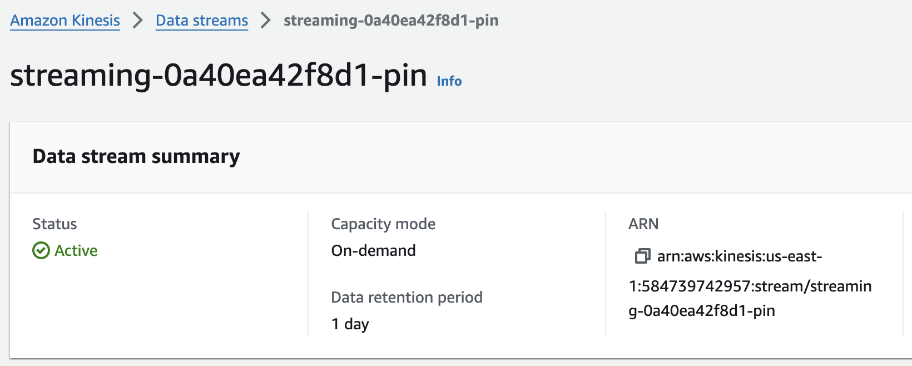

# Milestone 9 - Stream Processing: AWS Kinesis

## Task 1
### Create data streams using Kinesis Data Streams

Streams were created for each of the Pinterest tables (pin, geo and users) via AWS Kinesis Data Streams, for example:




## Task 2
### Configure the API with Kinesis proxy intergration

Before configuring the API, to allow the API to invoke Kinesis Actions, the appropriate access role was retrieved ```0a40ea42f8d1-kinesis-access-role``` via AWS IAM.

To configure the API with all the necessary integrations, resources and methods must be added, to the API previously used, so that the API is able to invoke the following actions: 
- List streams in Kinesis
- Create, describe and delete streams in Kinesis
- Add records to streams in Kinesis

First, a new resource was created called streams:

 

A ```GET``` method was created withing the resource:


 


 

The integration request was edited to add a HTTP request header and mapping template:


 

Within the ```/streams``` resource, a new resource was create ```/{stream-name}``` with methods ```GET```, ```POST``` AND ```DELETE``` in the same way as before but with the respective action names and mapping templates:

#### <u>```/{stream-name} GET``` Method</u>

**Action:** DescribeStream

**Mapping Template:**

```
{
    "StreamName": "$input.params('stream-name')"
}
```

#### <u>```/{stream-name} POST``` Method</u>

**Action:** CreateStream

**Mapping Template:**

```
{
    "ShardCount": #if($input.path('$.ShardCount') == '') 5 #else $input.path('$.ShardCount') #end,
    "StreamName": "$input.params('stream-name')"
}
```

#### <u>```/{stream-name} DELETE``` Method</u>

**Action:** DeleteStream

**Mapping Template:**

```
{
    "StreamName": "$input.params('stream-name')"
}
```

Resulting in API structure:


Within the ```/{stream-name}``` resource, new resources ```/record```  and ```/records``` were created, each containing a ```PUT``` method. This was done in the same way as before but with the respective action names and mapping templates:

#### <u>```/record PUT``` Method</u>

**Action:** PutRecord

**Mapping Template:**

```
{
    "StreamName": "$input.params('stream-name')",
    "Data": "$util.base64Encode($input.json('$.Data'))",
    "PartitionKey": "$input.path('$.PartitionKey')"
}
```

#### <u>```/records PUT``` Method</u>

**Action:** PutRecords

**Mapping Template:**

```
{
    "StreamName": "$input.params('stream-name')",
    "Records": [
       #foreach($elem in $input.path('$.records'))
          {
            "Data": "$util.base64Encode($elem.data)",
            "PartitionKey": "$elem.partition-key"
          }#if($foreach.hasNext),#end
        #end
    ] 
}
```

Resulting in final API structure:


API was deployed and the new Invoke URL was taken note of

## Task 3
### Send data to Kinesis Streams

```streaming_user_posting_emulation.py``` (```Link to file```) was created which builds upon the ```user_posting_emulation.py``` (```Link to file```) to send the Pinterest data to the newly modified API which then sends the data to shards in the coresponding streams in AWS Kinesis.

## Task 4-6
### Read, clean and write data from Kinesis Streams to Databricks delta tables

Stream data was read from each of the Kinesis Stream, cleaned and then was written to their respective delta tables using the code in notebook
(```link to notebook here```) all_stream_data_processing.ipynb

We can see that the data has been successfully proccessed via the writeStream outputs.

#### Pin:


#### Geo:


#### User:


We can also see that the data has been successfully proccessed via the delta tables in databricks.

#### Pin:


#### Geo:


#### User:


